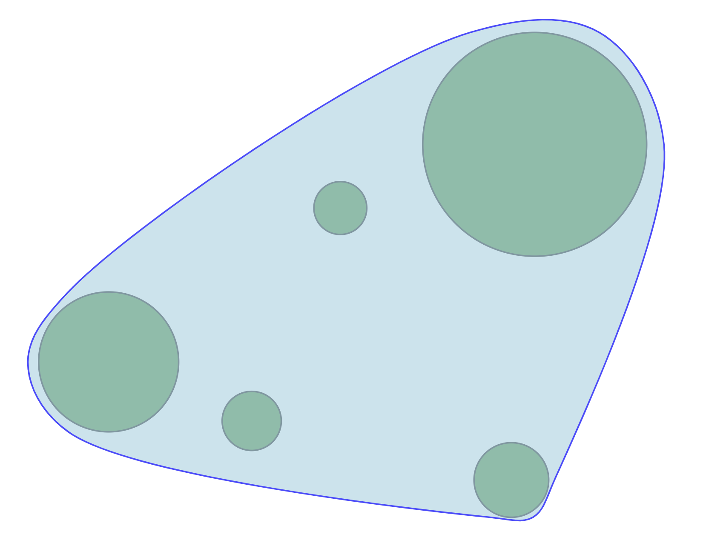

## Introduction of the project

This project aims to visualize the **smooth curve boundary of a series of different circles** with specified center coordinates and radius. Instead of traditional polygon convexhull, this kind of boundary is more like an **approximate smooth convexhull** of disks (PS: In [geometry](https://en.wikipedia.org/wiki/Geometry), a **disk** ([also spelled](https://en.wikipedia.org/wiki/Spelling_of_disc) **disc**)[[1\]](https://en.wikipedia.org/wiki/Disk_(mathematics)#cite_note-odm-1) is the region in a [plane](https://en.wikipedia.org/wiki/Plane_(geometry)) bounded by a [circle](https://en.wikipedia.org/wiki/Circle). A disk is said to be *closed* if it contains the circle that constitutes its boundary, and *open* if it does not.[[2\]](https://en.wikipedia.org/wiki/Disk_(mathematics)#cite_note-2)).

## Overview

## How to run the project?

1. `yarn` or `npm install` to install all the dependencies
2. `yarn dev` or `npm run dev` to start the dev server
3. Viist `http://localhost:5173/`
